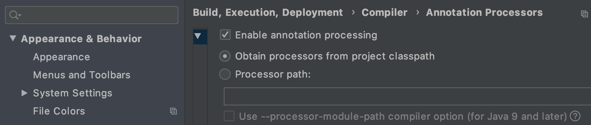
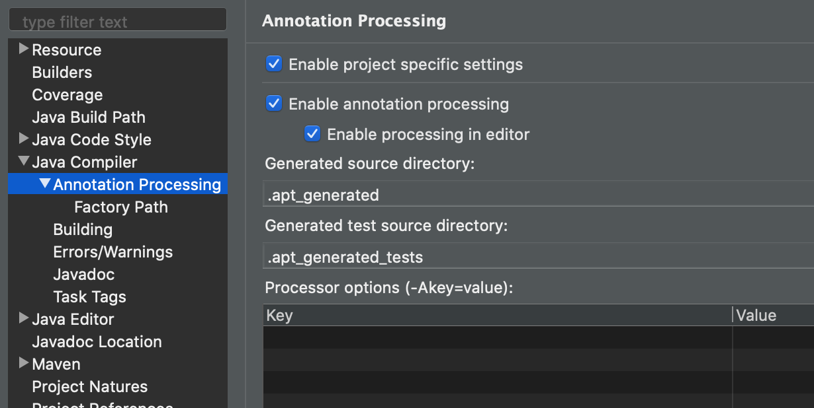
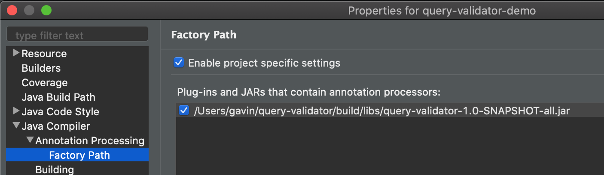
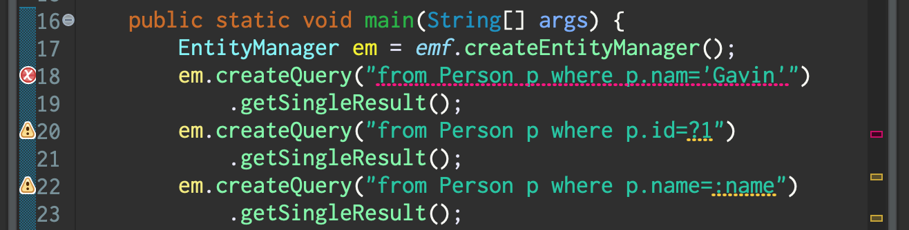

![Hibernate logo][]

# Hibernate Query Validator

Compile time validation for queries written in HQL and JPQL.

[Hibernate logo]: http://static.jboss.org/hibernate/images/hibernate_logo_whitebkg_200px.png

## Building

Type `./gradlew` from this project directory.

This produces an artifact with the Maven coordinates 
`org.hibernate:query-validator:1.0-SNAPSHOT` in your local
Maven repository.

It also creates a far jar `query-validator-1.0-SNAPSHOT-all.jar`
in the `build/libs` directory of this project.

## Usage

The persistent entity classes *must* be annotated with the 
basic JPA metadata annotations like `@Entity`, `@ManyToOne`, 
`@Embeddable`, `@MappedSuperclass`, `@ElementCollection`, and 
`@Access`. You *may* use XML-based mappings to specify database 
mapping information like table and column names if that's what 
you prefer.

1. Put `query-validator-1.0-SNAPSHOT-all.jar` in the 
   compile-time classpath of your project. (Or depend on
   `org.hibernate:query-validator:1.0-SNAPSHOT`.)
2. Annotate a package or toplevel class with `@CheckHQL`.

Then the validator will check any static string argument of

- the `createQuery()` method or
- the `@NamedQuery()` annotation

which occurs in the annotated package or class. 

#### Errors

A compile-time error is produced if

- the query has syntax errors,
- an entity name in the query doesn't reference a persistent 
  entity class, or
- a member name in the query doesn't reference a mapped field 
  or property of the entity.

#### Warnings

A compile-time warning is produced if

- the query calls a function which isn't defined by the JPA 
  specification or by HQL.

The warning may be suppressed by adding the function name to 
the `whitelist`:

    @CheckHQL(whitelist={"stddev", "variance", "md5"})

It's even possible to whitelist all the SQL functions known 
to a certain Hibernate `Dialect`:

    @CheckHQL(dialect=HSQLDialect.class)

Additionally, any JPA `Query` instance that is created and 
immediately invoked in a single expression will have its 
parameter bindings validated. A warning is produced if

- the query string has a parameter with no argument specified 
  using `setParameter()`, or
- an argument is specified using `setParameter()`, but there 
  is no matching parameter in the query string.

### Usage from command line

When using a command line compiler, `gradle`, or `mvn`, errors 
from the query validator are displayed in the compiler output 
alongside other compilation errors.

#### `javac` and ECJ

Just compile your code with `javac`, or even with ECJ
(`java -jar ecj-4.6.1.jar`), with the query validator `jar` in 
the classpath: 

    -classpath query-validator-1.0-SNAPSHOT-all.jar

#### Gradle

Annoyingly, Gradle requires that the dependency on the query
validator be declared *twice*:

    dependencies {
        implementation 'org.hibernate:query-validator:1.0-SNAPSHOT'
        annotationProcessor 'org.hibernate:query-validator:1.0-SNAPSHOT'
    }

#### Maven

Maven handles annotation processors correctly. Just declare 
the dependency to the query validator.

    <dependencies>
        <dependency>
            <groupId>org.hibernate</groupId>
            <artifactId>query-validator</artifactId>
            <version>1.0-SNAPSHOT</version>
        </dependency>
    <dependencies>

### Usage in IDEs

Both IntelliJ and Eclipse require that annotation processing
be explicitly enabled.

#### IntelliJ

Select **Enable annotation processing** in IntelliJ IDEA 
preferences under **Build, Execution, Deployment > Compiler > 
AnnotationProcessors**. 

IntelliJ only runs annotation processors during a build (that
is, when you `Run` your code or explicitly `Build Project`). 
So you won't see errors in your Java editor as you're typing.

#### Eclipse

Eclipse IDE doesn't load annotation processors from the 
project classpath. So you'll need to add the query validator
manually.

1. In **Project > Properties** go to **Java Compiler > 
   Annotation Processing** and select **Enable annotation 
   processing**. 
2. Then go to **Java Compiler > Annotation Processing > 
   Factory Path** and click **Add External JARs...** and
   add `build/libs/query-validator-1.0-SNAPSHOT-all.jar` 
   from this project directory.

Your project properties should look like this:

Eclipse runs annotation processors during every incremental
build (that is, every time you `Save`), so you'll see errors
displayed inline in your Java editor.

If the query validator doesn't run, please ensure that:

- Eclipse itself is running on JDK 8.
- Your project is set up to compile with a JDK 8-compatible
  compiler, and the compiler compliance level is set to 1.8.  

## Compatibility

The query validator was developed and tested with:

- JDK 1.8.0
- Hibernate 5.4.10.Final
- ECJ 4.6.1
- Eclipse IDE 2019-03 to 2020-03 (JDT Core 3.17.0 to 3.18.300)

Other versions of `javac`, ECJ, and Hibernate may or may not 
work. The query validator depends on internal compiler APIs in 
`javac` and ECJ, and is therefore sensitive to changes in the 
compilers.

_NOTE: this version of the query validator does not work on
JDK 9 and above. The [jdk10][] branch in git is a preview of
the changes required to make it work on JDK 9-12._

[jdk10]: https://github.com/hibernate/query-validator/tree/jdk10

## Caveats

Please be aware of the following issues.

#### HQL is a superset of JPQL

Queries are interpreted according to Hibernate's flavor of JPQL 
(i.e. HQL), which is a superset of the query language defined by 
the JPA specification.

One important example of how the languages are different is the
handling of function names. In the JPA spec, function names like
`SUBSTRING`, `SQRT`, and `COALESCE` are *reserved words*. In HQL, 
they're just regular identifiers, and you may even write a HQL
query that directly calls a user-defined or non-portable SQL 
function.

#### Function arguments are not checked

Hibernate's query translator never typechecks function arguments 
and instead simply passes anything which looks like it might be 
a function call straight through to the database.

Fixing this will require a nontrivial enhancement to Hibernate's
HQL translator.

#### Explicit entity names are not supported in Eclipse/ECJ

In ECJ, don't use `@Entity(name="Whatever")`, since during an
incremental build, the processor won't be able to discover the
entity named `Whatever`. (Just let the entity name default to
the name of the class.) 

#### Some ugly error messages

Sometimes Hibernate's HQL parser produces ugly error messages,
which are passed on by the query validator.

Fixing this requires a new release of Hibernate.
